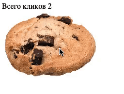

# Игра-кликер

Домашнее задание к занятию 1.1 «Возможности JavaScript в браузере».

## Описание 

Необходимо разработать нового «убийцу времени» - кликер печенек. Всё, что делает игра - 
увеличивает счётчик нажатий на печеньку.

### Исходные данные

Основная HTML-разметка

### Процесс реализации

1. Увеличивайте значение счётчика при каждом клике на печеньку
2. Чередуйте уменьшение и увеличение печеньки при каждом клике (уменьшайте и увеличивайте значения width/height)

### Повышенный уровень сложности (не обязательно)

Добавьте параметр «Скорость клика». Он должен показывать среднее количество
кликов в секунду. Значение обновляется при каждом новом клике.

Например, с момента последнего клика прошло 0.5 секунды. 
Тогда скорость клика = 1/0.5 = 2 клика в секунду
